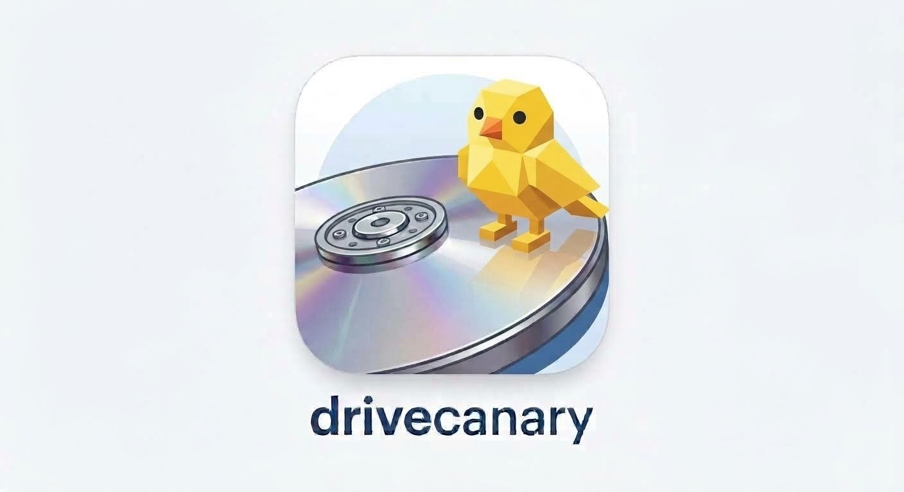

<p align="center"></p>

# drivecanary

Drive health for a home LAN: SMART, pool state and trends from every host, on one page. A hub VM pulls from
each host over ssh once an hour, keeps every reading in one SQLite file, and shows what is failing, what is
about to, and what has not been heard from. Formerly pyvmind: `docs/audit-2026-09-28.md` is the audit that
led to the rebuild and `docs/transport-design-2026-09-28.md` the collection design; both are worth a read
before changing how collection works.

## How it fits together

- **Hosts** run nothing between collections. Each has a `drivecanary` user whose only ssh key is the hub's,
  bound by a forced command to `deploy/host/gate`; the gate runs `deploy/host/probe` as root through one
  sudoers line, and the probe runs `smartctl -j -x` per device, `zpool`/`btrfs`/`mdadm` where present, and
  hands back everything it saw plus the tail of smartd's attribute logs since the hub last read them.
  `deploy/host/install-host.sh HOST` sets all of that up from your workstation.
- **Push hosts** are the exception: a host that is only up on demand, or the hypervisor the hub runs on,
  runs `deploy/host/agent` from a timer instead and reports to the hub with a token. Same probe, same data.
- **The hub** (`drivecanary collect`, from a systemd timer) parses what came back (`smartctl -j` JSON: no text
  scraping), judges every drive (`drivecanary/status.py`: SMART PASSED is not enough; the exit bits,
  Backblaze's five counters and the NVMe health log are), and records for every host what happened, so a
  silent host always has a reason on its row.
- **The page** (`drivecanary web serve`, FastAPI + Jinja2 + uPlot) reads the database and nothing else: the
  overview worst-first, a page per drive with trends, the hosts and their attempts.
- **History** comes from two places: the hourly probe, and smartd's own attrlog CSVs, which Debian has been
  writing every 30 minutes on every host for years (`drivecanary import attrlog` for copies; the collector
  keeps pulling new lines afterwards).

## Development setup

Requirements: Python 3.13, `uv`.

```bash
uv sync                      # create .venv with all dependencies
make dev-config              # dev/config.toml pointing everything at ./dev (gitignored)
make dev-db                  # create the database schema under ./dev
make test                    # the suite: no network, no root; the real gate and probe run against shims
make check                   # ruff + mypy --strict + pytest
```

The CLI reads its configuration from `$DRIVECANARY_CONFIG`, falling back to `/etc/drivecanary/config.toml`;
the Makefile exports `dev/config.toml` for you.

```bash
export DRIVECANARY_CONFIG=dev/config.toml
uv run drivecanary config check
uv run drivecanary host add atlas --address atlas.domain --tz America/New_York --no-keyscan
uv run drivecanary import attrlog data/attrlogs/atlas/*.csv --host atlas      # 2.8 years in ~20 s
uv run drivecanary status
uv run drivecanary web serve                                                  # http://127.0.0.1:8080/
uv run drivecanary collect --host atlas                                       # needs the host set up: deploy/README.md
```

Everything in the page and the CLI works offline on imported attrlogs; the first real collection adds the
identity smartctl knows (model family, firmware, WWN, capacity), the pools, and NVMe drives.

## Layout

- `src/drivecanary/config.py` — the settings model; `deploy/config.example.toml` is generated from it
  (`make config-example`) and a test fails when it is stale.
- `src/drivecanary/models.py` — SQLAlchemy models; `alembic/` — migrations (`drivecanary db migrate`).
- `src/drivecanary/smart.py` — `smartctl -j` into a flat report; `status.py` — the OK/WARN/FAIL rules.
- `src/drivecanary/envelope.py` — the byte stream the gate sends; `ingest.py` — that stream into rows;
  `collect.py` — the ssh pull, parallel per host, one transaction per host.
- `src/drivecanary/push.py` — what a push agent delivers, stored the same way; `ingest_api.py` — the
  listener it delivers to, a service of its own so the page stays read-only.
- `src/drivecanary/pools.py` — which drives a pool is made of: what its status names, found in what the
  host reports.
- `src/drivecanary/attrlog.py` — smartd attribute logs, whole files or chunks past a cursor.
- `src/drivecanary/queries.py` — what the page and `drivecanary status` show; `web/` — the page.
- `deploy/` — the VM install (`install.sh`, `update.sh`, `backup.sh`, units) and `deploy/host/` — what goes
  on each monitored host (`probe`, `gate`, `agent`, `sudoers`, `install-host.sh`). See `deploy/README.md`.
- `scripts/make_icons.py` — cuts the page's icons from `docs/logo.jpg` (run by hand when the logo changes).
- `data/attrlogs/` — attrlog CSVs pulled by hand from hosts (atlas's, in their own commit);
  `data/legacy-smartctl-text/` — two 2017 `smartctl -a` captures from storage1 and storage2, kept as history.
- `tests/fixtures/smartctl/` — real `smartctl -j` captures (from Scrutiny's test data, MIT) covering ATA,
  SATA SSD, NVMe, SAS, a USB bridge, a failing drive and an open failure.

## Not yet

NVMe attribute logs and scheduled NVMe self-tests (smartd does both only from smartmontools 7.5), an importer for the two 2017 text
captures, and hosts other than Debian and OPNsense. Alerting is smartd's job on each host (`-M exec`), not the hub's.
