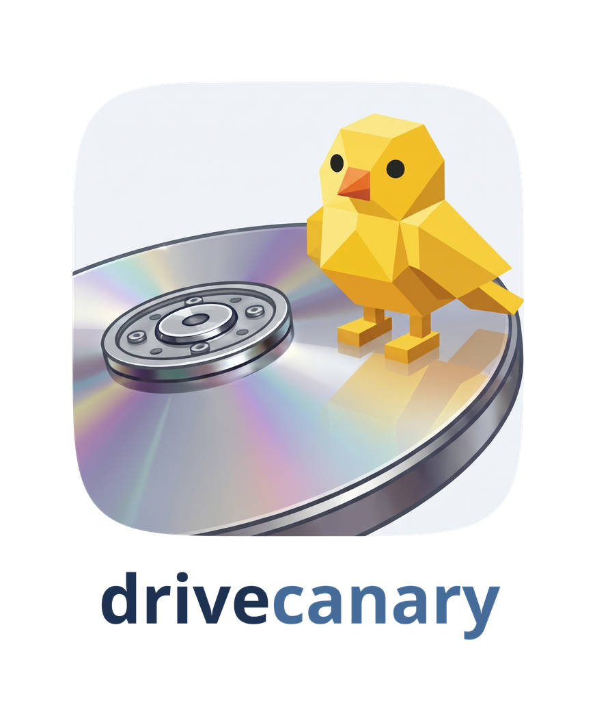

<p align="center"><picture>
  <source media="(prefers-color-scheme: dark)" srcset="docs/logo-dark.png">
  
</picture></p>

# drivecanary

Drive health monitoring for a LAN:
- Saves all SMART data, for years, in one SQLite file
- Trend graphs, and warnings when the SMART attributes that predict failure tick up
- Reads SMART error logs: a failing drive, a bad cable and a harmless aborted command each read differently
- Schedules SMART self-tests on every host, each drive on a date of its own
- Watches ZFS, btrfs and mdadm pools, and their scrubs
- A drive keeps its history when it moves between hosts, or is retired and comes back
- Imports history already on your hosts (smartd's attribute logs) and old `smartctl -a` captures
- Two ways for data to reach the hub VM: it pulls over ssh, or the host pushes over HTTP
- A JSON API for other services: `GET /api/v1/host/NAME` says whether a host and its drives are ok, and why not;
  `/api/v1/openapi.json` describes it
- Runs on Debian and Proxmox hosts and OPNsense routers; hosts need nothing but smartmontools and a
  read-only probe

## Development quickstart

Requirements: Linux, Python 3.13+, `uv`.

```bash
git clone <this repository> && cd drivecanary
uv sync                                  # .venv with every dependency
make check                               # ruff, mypy --strict and the tests

make dev-config                          # dev/config.toml: database and keys under ./dev
export DRIVECANARY_CONFIG=dev/config.toml
make dev-db                              # create the database

# load some history to look at: a host's smartd logs, copied from /var/lib/smartmontools/attrlog.*.csv
uv run drivecanary host add atlas --address atlas.domain --no-keyscan
uv run drivecanary import attrlog path/to/attrlog.*.csv --host atlas

uv run drivecanary web serve             # http://127.0.0.1:8080/
uv run drivecanary status                # the same, in the terminal
```

To read a real host live, your checkout plays the hub: give it a key, install the host pointed at your
machine, and collect.

```bash
ssh-keygen -t ed25519 -N '' -f dev/ssh/id_ed25519
deploy/host/install-host.sh atlas --hub-ip YOUR-IP --hub-key dev/ssh/id_ed25519.pub   # ends with a fingerprint
uv run drivecanary host keyscan atlas --fingerprint SHA256:...
uv run drivecanary collect --host atlas
```

## Production quickstart

The hub is a small Debian VM (1 vCPU, 1 GB) with a static address. As root on it:

```bash
apt install git curl openssh-client
curl -LsSf https://astral.sh/uv/install.sh | env UV_INSTALL_DIR=/usr/local/bin sh
git clone <this repository> /opt/drivecanary
/opt/drivecanary/deploy/install.sh       # prints the hub's public key
```

Then, for each host, from a checkout on your workstation (root ssh to the host) and on the hub:

```bash
deploy/host/install-host.sh atlas --hub-ip HUB-IP --hub-key 'ssh-ed25519 AAAA...' --self-tests   # ends with a fingerprint
drivecanary host add atlas --address atlas.domain --fingerprint SHA256:...                       # on the hub
```

For hosts that the hub should not have access to (e.g. its own hypervisor, a router), use push instead:
`drivecanary host add hv --transport push` on the hub, prints a token
`deploy/host/install-host.sh hv --push --hub-url http://HUB-IP:8081 --token TOKEN`.

The page is at `http://HUB-IP:8080/`, and its hosts page repeats these steps with your hub's address and key
filled in. Settings are in `/etc/drivecanary/config.toml`; backups, updates and troubleshooting are in
`deploy/README.md`.

## How it works

- **Hosts** run a root-owned, read-only probe behind one sudoers line. It runs `smartctl -j -x` per drive and
  the pool tools, and passes back their output untouched, with whatever smartd has logged since last time.
- **Pull hosts** let the hub's key run only that probe (a forced command). **Push hosts** run it from a timer
  and send the result to the hub with a per-host token.
- **The hub** parses and judges everything (SMART PASSED is not enough: exit bits, Backblaze's five counters,
  the NVMe health log, the error log), and records why any host went quiet.
- **The page** reads the database and nothing else.

`docs/design.md` for more detail.

Layout:

- `src/drivecanary/` — `smart.py` reads smartctl's JSON, `status.py` judges it, `ingest.py` stores it,
  `collect.py` pulls, `push.py`/`ingest_api.py` receive pushes, `web/` is the page, `config.py` the settings.
- `deploy/` — the VM install and units; `deploy/host/` — what goes on each host (`probe`, `gate`, `agent`,
  `selftests`, `install-host.sh`).
- `tests/` — runs the real host scripts against stand-ins; no network, no root.

Examples and tests use placeholders (`atlas`, `hv`, `10.100.100.x`, `HOST.domain`). `scripts/check-private`
keeps your own names, addresses and serials out of commits.

## Todo

- NVMe attribute logs and NVMe self-test schedules (smartd has both only from smartmontools 7.5)
